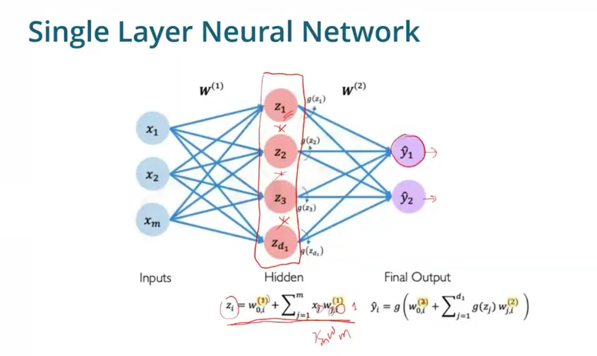
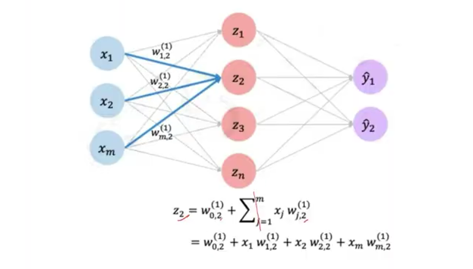
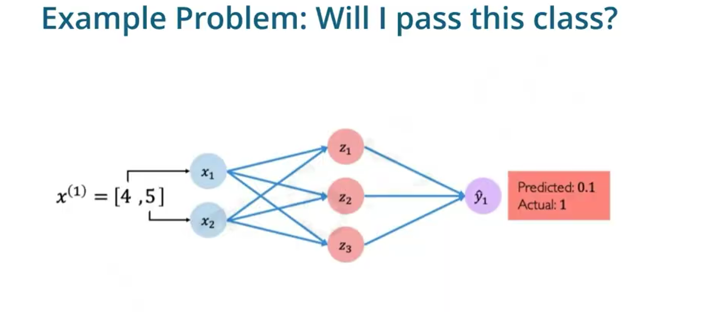
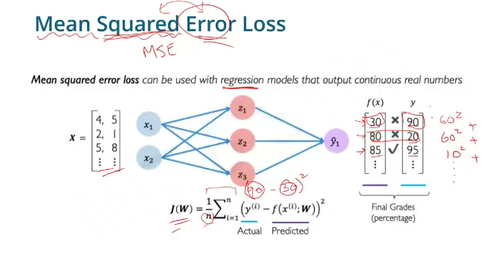
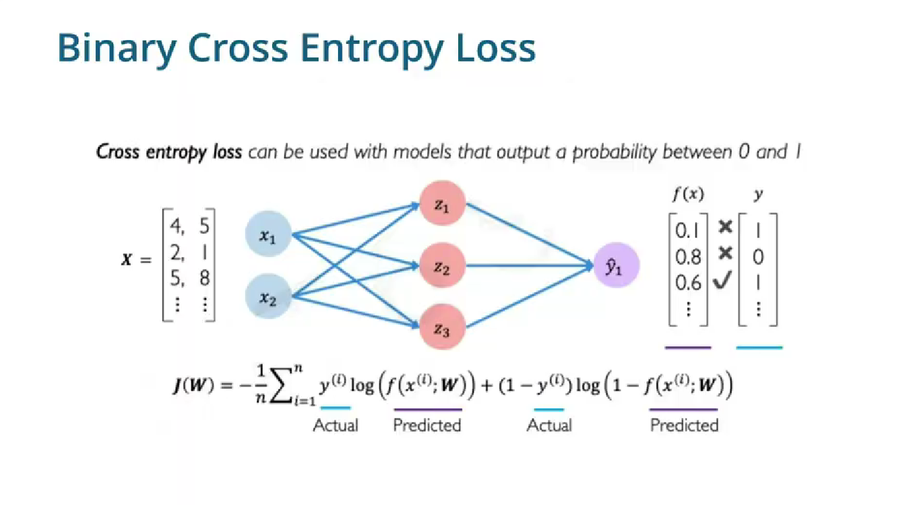
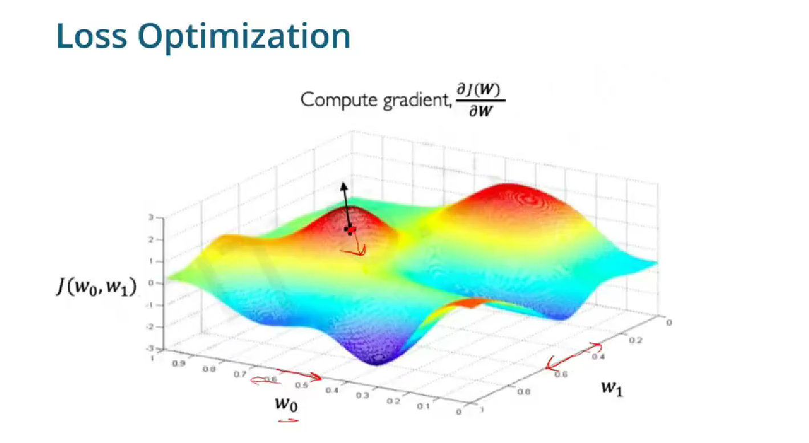
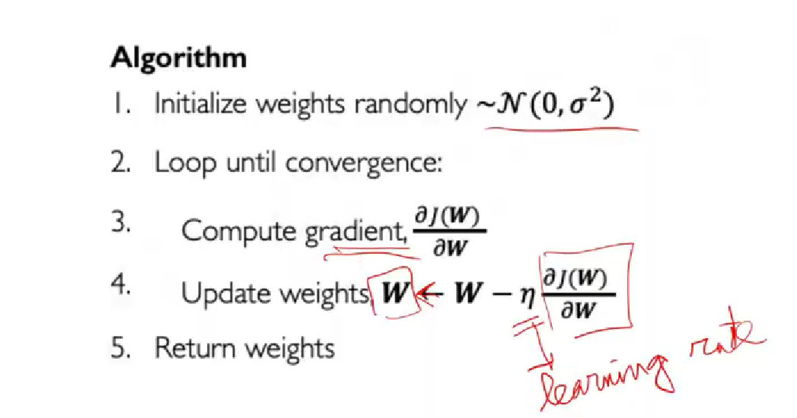
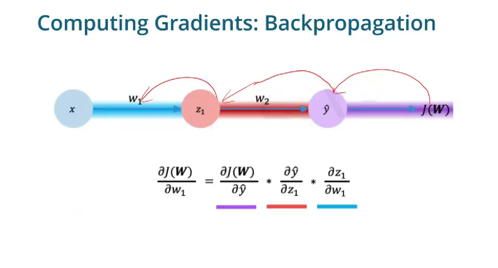

- No of classes = no of neurons
- weights are decided by neurons in the prev layer




<br/>

In the above pic y1 = cat, y2= dog if there was a third class it would be called y3

- z= w0 + (Xt*W)
- w0 = bias, Xt = features, W = weights


### WRT 'Z2' neuron from hidden layer



<br/>

### How do neural net learn? 

- First pass 

<br/>



<br/>

- To update the model we then use empiral loss:
    - MSE

    
    
    - Cross Entropy loss
    
    

### Computing Losses

- Then we look for weights that will minimize our losses through a function like **Gradient Descent**   

<br/>



<br/>


- Loss -> on every epoch 
- Cost -> on entire model, calculated at the end using evaluate

### In each cycle :

- predict 
- calculate loss
- minimize loss
- compute gradient
- update weights




### Updating Loss


<br/>



<br/>


```
train_loss = history_mlp_val.history['loss']
test_loss, test_accuracy = model_mlp_val.evaluate(X_test, y_test, verbose=0)
```

## Loss Optimization Techniques

- SGD (on a sample)
- Adagrad
- more

SGD takes time, better is to use batch gradient descent


## Some models I have built

[Iris Dataset](../iris.md)

[Deep Learning Model for Self generated Spirals](../mlp_for_spirals.md)

[Next - Regularization](regularization.md)
