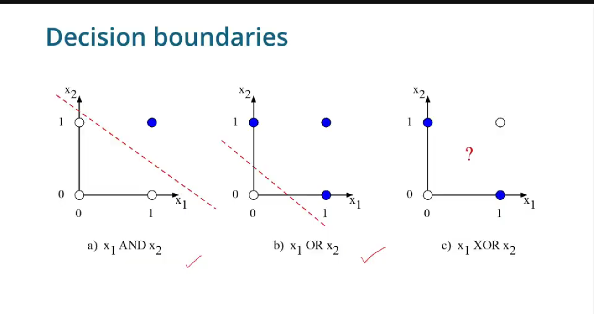
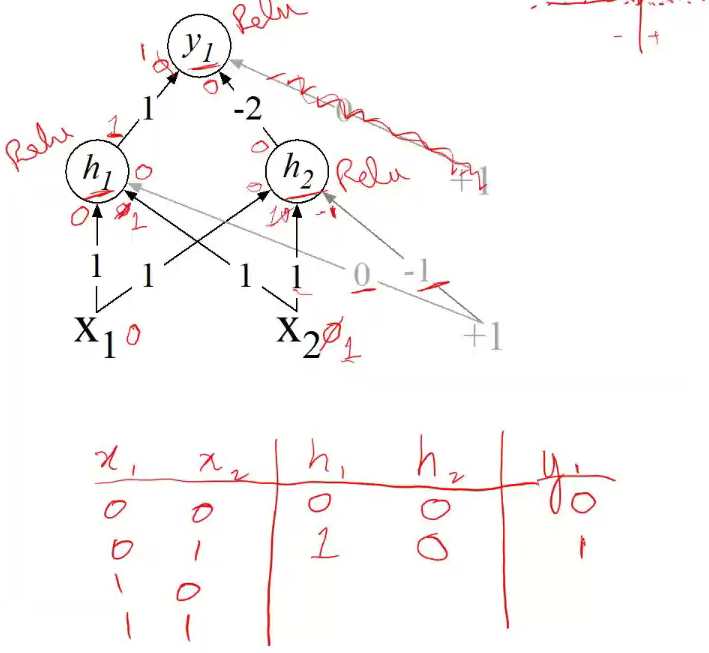
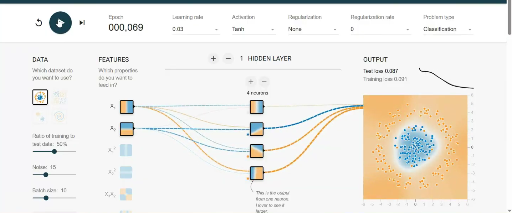

### Non linearity

 

 

As it can be seen from the image, that some prob are not linearly solvable. In order to fix this a classic example is of XORing two features. 

 

The above is a good example of how a XOR works provided that activation is ReLu.

 

 
- Because the above problem is segregated through a circle it needs a polynomial x2+y2 to solve this therefore two neuron

- If problem is too ❗❗❗ add hidden layers

- Universal Approximation Theorem suggest that any problem can be solved if we know the correct number of neurons

[Next - Neural Networks ](Neural_Net.md)
