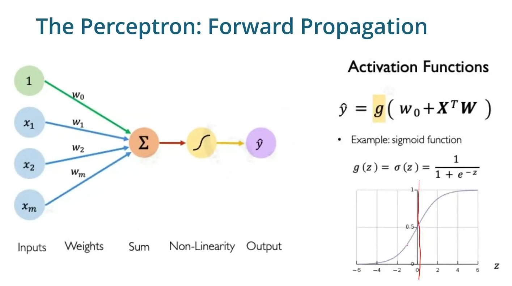
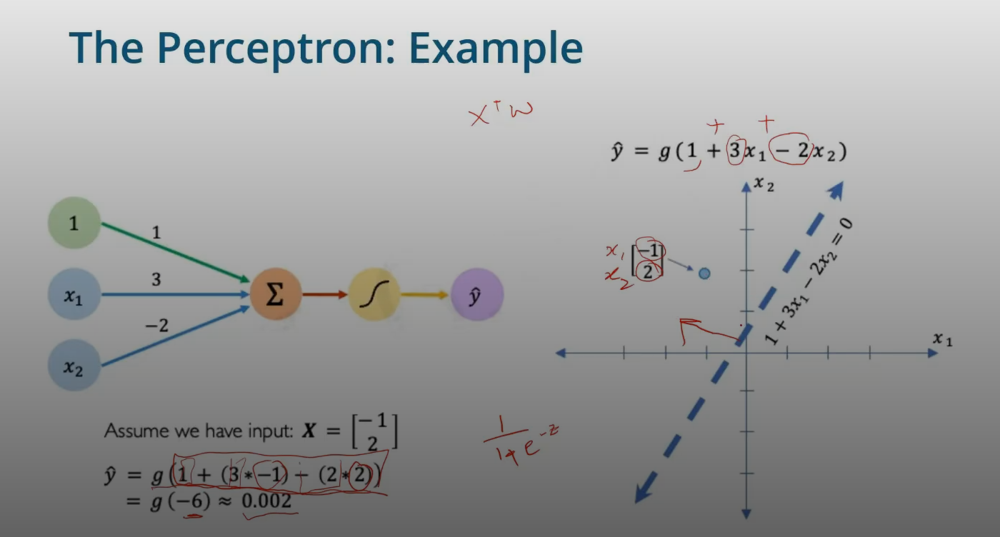

The following is how we start a DL model
 

 

where

- X -> any data point or points (features)
- W ->  weights
- Wo -> biases
- g -> activation function 
- y > 0.5, z > 0 
- y < 0.5, z < 0 
### Activation Functions

- A value goes in and the function coverts that into a non - linear value

### Working example of a perceptron

 

[Next - Non Linearity](Non-Linearity.md)