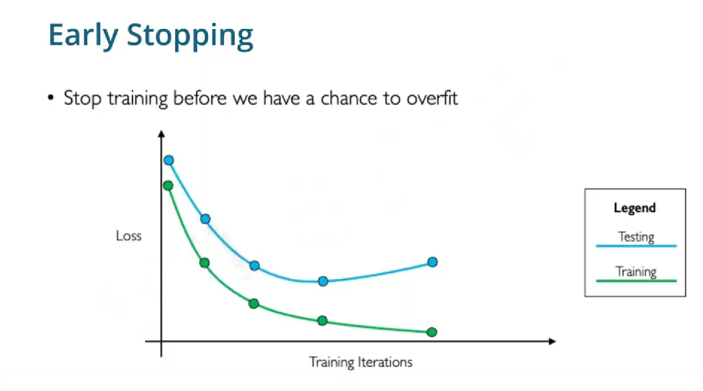

### Early stop

- Stops where val-loss diverges and use the current weights

### Dropout 

- In an ideal net, neural nets are fully connected
- In dropout, it switches off some connections

### L2

- preventing larger weights by adding penalty