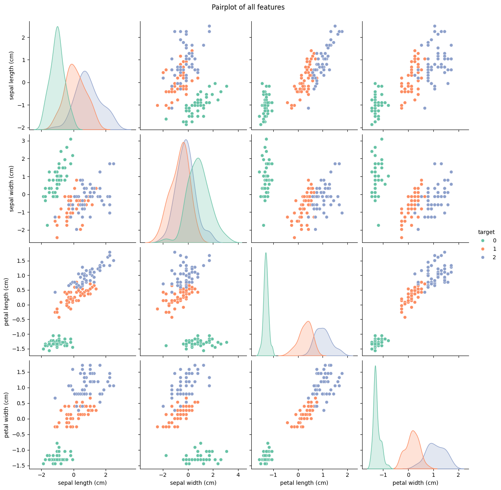
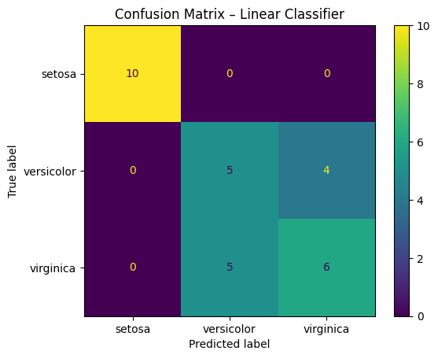
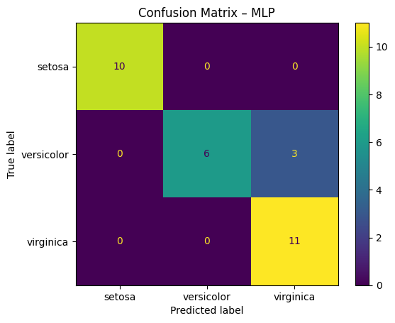
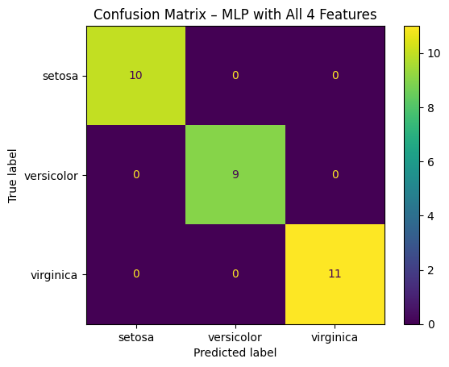

# Iris Classification Problem

### Dataset Description

- There are three classes of iris 
    - setosa
    - versicolour
    - virginica

- The features include:
    - sepal length (cm)
    - sepal width (cm)
    - petal length (cm)
    - petal width (cm)

### EDA

- While doing EDA using pairplot, it seems clear that setosa (represented by 🟢) would be easier to classify

 

 

### Model with no Hidden Layers

- Activation = softmax
- Neurons = 3
- optimizer = adam
- loss = categorical cross entropy
- metric = accuracy
- Total params = 4 (Input) * 3 (weights) = 12 + 3 (bias with each weight)
- Accuracy - 70%

 

 

### Multi Layer Perceptron (MLP) having one hidden layer

- Activation = relu, softmax
- Neurons = 8, 3
- optimizer = adam
- loss = categorical cross entropy
- metric = accuracy
- Total params = 67
- Accuracy - 90%

 

 

👑👑👑👑  
 ### MLP having 2 hidden layers

- Activation = relu, relu, softmax
- Neurons = 10, 6, 3
- optimizer = adam
- loss = categorical cross entropy
- metric = accuracy
- Total params = 137
- Accuracy - 100%

 

 
