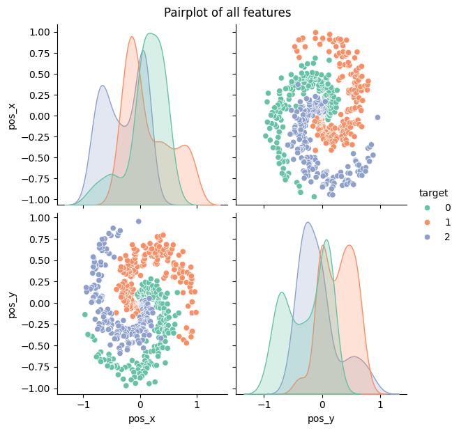
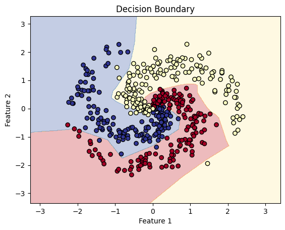

# Spiral Problem

## Data 

- X = x and y coordinates
- y = labels ranging from 0 - 2

- Total 3 classes are present

 

 

- If we are able to find an architecture for spiral data, we don't need to worry about overlapping classes 

 

 

### Deciding Neurons and Hidden Layers

- Hidden layers had to be more than 1 hidden layer
- Spiral data can not be solved in less than one layer
- Tried and tested with 2 layers (accuracy = 55%, train loss = 90%)
- Tried and tested with 3 layers (accuracy = 91%, train loss = 33%)
- Tried and tested with 4 layers (accuracy = 93%, train loss = 20% ) 
- For 4 layers, accuracy comes out to be 92% 

*Continuing with 4 layers*

### Learning Rates

### LR - Accuracy %, loss

- 0.0001 - 55 %, 0.9
- 0.001  - 95 %, 0.12  ⭐ Improved accuracy and loss
- **0.01 - 98 %, 0.04**
- 0.1 - 80% 📉 Drops 

*Continuing with LR = 0.01*

### Overfitting and Underfitting

- Using Early Stopping lets us stop between Epochs = 19 to 32
- We were doing 100 Epochs
- Final accuracy = 96%, Loss = 0.09

### Final Decision Boundary

 

 

### Improving Model

- Would work on improving accuracy with 3 layers 
- Because our final accuracy is within the range that was already achieved through 3 hidden layers

[Code](Notebooks/MLP_for_spirals.ipynb)

